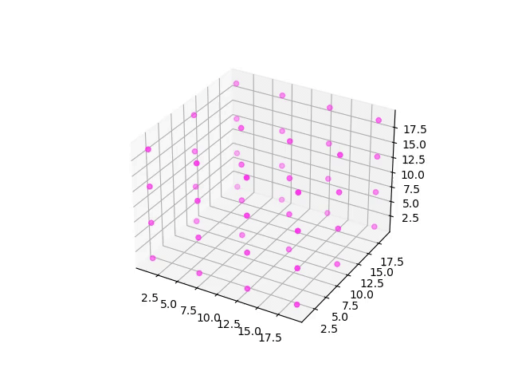
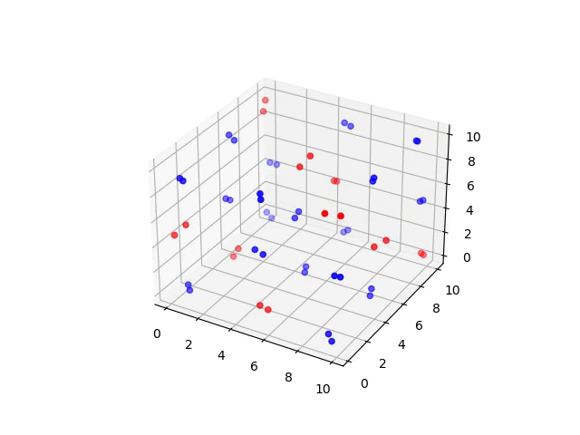

Molecular Dynamics of Simple Systems: Ab initio MD simulation of mono- and diatomic molecules
==============================================================

This MD-Simulation was made for the course Statistical Physics and Computer Simulation
at ETH Zurich by Jonas Luther and Rafael Steiner. 

The given task was to transform an MD simulation with a classical Lennard-Jones potential
to an ab initio simulation.

We chose to use psi4 as the library to perform our ab initio calculations.

Current Status of the Project

-----------------------------

* This Project is still under construction and there will soon be coming more changes to the program. 
  Keep an eye on the repository to stay updated.

Results

--------

* Classical MD-Simulation with 1000 Lennard-Jonesium potential over the time span of 1ps

* Ab-Initio Simulation of 48 Helium atoms over a time span of 50 fs

  
* Ab-Initio Simulation of 64 H2 molecules over a time span of 50 fs

  
* Ab-Initio Simulation of 27 Molecules H2/O2 mixture over a time span of 50 fs

How to run

----------

* install all the required dependencies:
    * C++ 17:
        * glm 0.9.9.9
    * Python 3.8:
        * matplotlib 3.3.4
        * numpy 1.19.2
        * psi4 1.4rc2.dev99+c4c438c
        * mendeleev 0.5.2
    
* create a folder called `tmp` at the root of the project
* build the project located at `./mdatom-main/CMakeLists.txt` with CMake
* run the python script main.py in the ab_initio folder
* run mdatom with the file `./mdatom-main/input.txt` as the argument 

Additional features

---------------------

* In each frame of the simulation a PNG of the current state is created in the `./animation` folder. 
  These files can be converted into an MP4 `output_name.mp4` with ffmpeg by running
  `ffmpeg -r 10 -i frame%d.png output_name.mp4`
  in the ./animation`folder.
  

  

